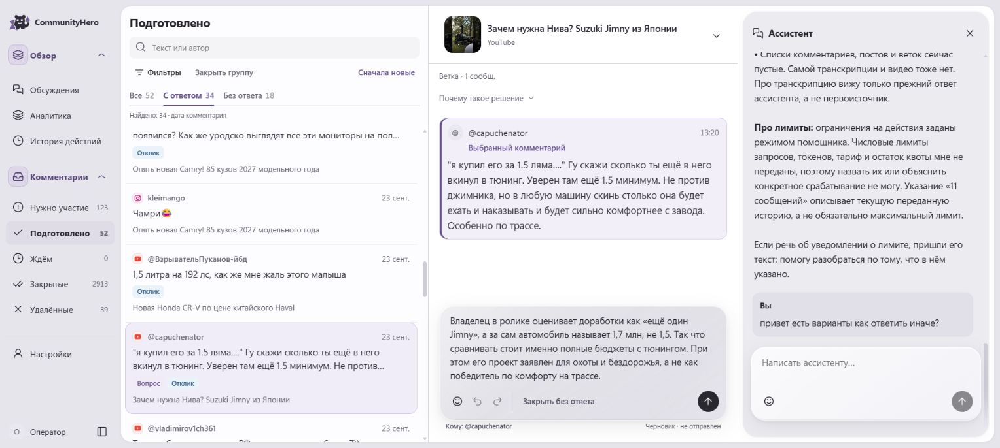
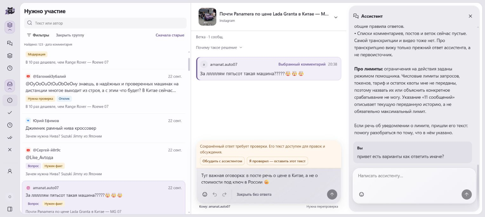
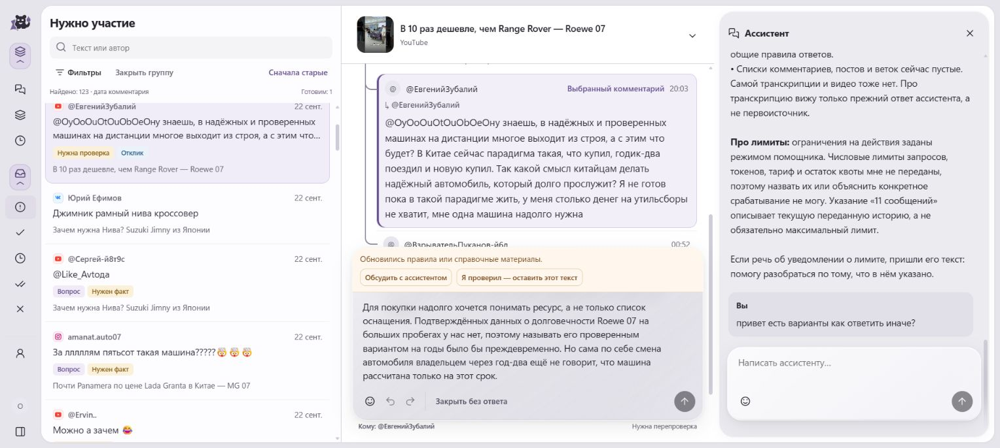

# CommunityHero — от работы комьюнити-менеджера к AI-платформе

**Как автоматизация собственной рутины и разработка платформы сошлись в инструменте для команды.**

Я пришёл работать комьюнити-менеджером: читал комментарии, разбирался в вопросах и готовил ответы с помощью ChatGPT. Постепенно захотелось связать эти действия в систему, которая сама собирает нужный контекст и готовит результат к проверке.

CommunityHero начал создавать чуть раньше; платформа развивалась параллельно с автоматизацией комментариев. Обе линии я развивал с AI coding agents. Они были основным инструментом реализации, тестов и ревью. Я отвечал за продуктовые решения, постановку задач, координацию разработки и приёмку по реальной работе с комментариями.

## От ручных ответов к конвейеру

Сначала я автоматизировал действия в интерфейсе. Такой подход оказался затратным, поэтому следующим шагом стало исследование веб-клиента Angry.Space и создание программного адаптера. Он позволил работать с данными и обрабатывать комментарии пакетами.

На реальной работе стало понятно, что одного текста комментария недостаточно. Система должна учитывать тему поста, предыдущие сообщения, уже известные сведения и характер разговора. Постепенно появились правила тона, контекст публикаций и веток, знания о компаниях и память разобранных случаев. Я уточнял их по обратной связи от работы с ответами. Это настройка контекста и правил, без обучения весов моделей.

## Контекст видео

Часть обсуждений относится к видео, поэтому системе понадобилось понимать и его содержание. Для распознавания речи я включил локальный Whisper на GPU. Полученные транскрипты сохраняются и повторно используются для одного материала на разных площадках.

Проверив альтернативные ASR, в рабочем процессе оставили Whisper.

## Инструмент для коллег

Параллельно с автоматизацией я развивал CommunityHero — рабочий интерфейс с очередью комментариев, областью чтения и панелью ассистента. В нём важен понятный путь от предложенного ответа к публикации: посмотреть контекст, прочитать черновик, отредактировать и подтвердить.

Когда коллеги заинтересовались инструментом, я решил не ждать утверждения решения в компании и будущих прямых интеграций. Уже развивающуюся платформу временно подключил к Angry.Space. Так две линии разработки сошлись: адаптер стал мостом для раннего использования CommunityHero.

Сайт и чатовое управление используют общий движок на Rust и PostgreSQL. Подготовленный результат, его редакция и подтверждение связаны между собой; после отправки система сверяет результат и контролирует повторы.

Дальнейший переход на прямые API соцсетей остаётся планом после организационных решений и получения необходимых доступов.

## Интерфейс

Живой рабочий интерфейс LikeAvto: очередь, выбранное обсуждение и панель ассистента. Снимки сохранены без ретуши. В панели открыт существующий разговор, который может относиться к другому комментарию.

### От очереди к черновику

Компактная очередь оставляет место для чтения и работы с ответом. В центре — выбранный комментарий и подготовленный черновик, который ещё не отправлен.

### Проверка факта перед отправкой

Вопрос о цене находится в разделе «Нужно участие». Сохранённый ответ отмечен для проверки; оператор может изменить текст, обсудить его или подтвердить после проверки.

### Работа с обсуждением

Выбранная реплика относится к обсуждению из пяти сообщений. Более ранние сообщения находятся выше видимой области; рядом доступен черновик ответа.

## Текущий статус

Коллеги используют CommunityHero в работе с комментариями LikeAvto через временный адаптер Angry.Space. Прямые интеграции с API соцсетей остаются следующим этапом.

## Исходный код и проверки

[Публичные исходники CommunityHero](https://github.com/SlopSurfer4444/CommunityHero-public) · [Проверенный снимок от 23 сентября 2026](https://github.com/SlopSurfer4444/CommunityHero-public/tree/ebc21b051bcd0cb3d68fe265081da0ff7eddae71)

Публичная версия содержит Rust-движок, SQL-миграции, HTTP/CLI, веб-интерфейс, адаптерные контракты и синтетические тесты и правила. Она позволяет изучить устройство системы и выполнить автономные проверки.

Рабочий провайдер Angry.Space в публичную копию не входит. Для подключения к живым площадкам интеграция и доступы настраиваются отдельно.

Для опубликованного снимка прошли проверка компиляции Rust для всех целей, 65 автономных Node-тестов и структурные проверки правил на 48 синтетических сценариях. [Результаты и область проверок](https://github.com/SlopSurfer4444/CommunityHero-public/blob/ebc21b051bcd0cb3d68fe265081da0ff7eddae71/VALIDATION.md).

## Технологии и подход

Rust, PostgreSQL, программный адаптер Angry.Space, локальный Whisper на GPU и интеграция языковых моделей. Сайт и чат используют общий движок. AI coding agents — центральный инструмент разработки; продуктовые решения и окончательная проверка результата оставались за мной.
