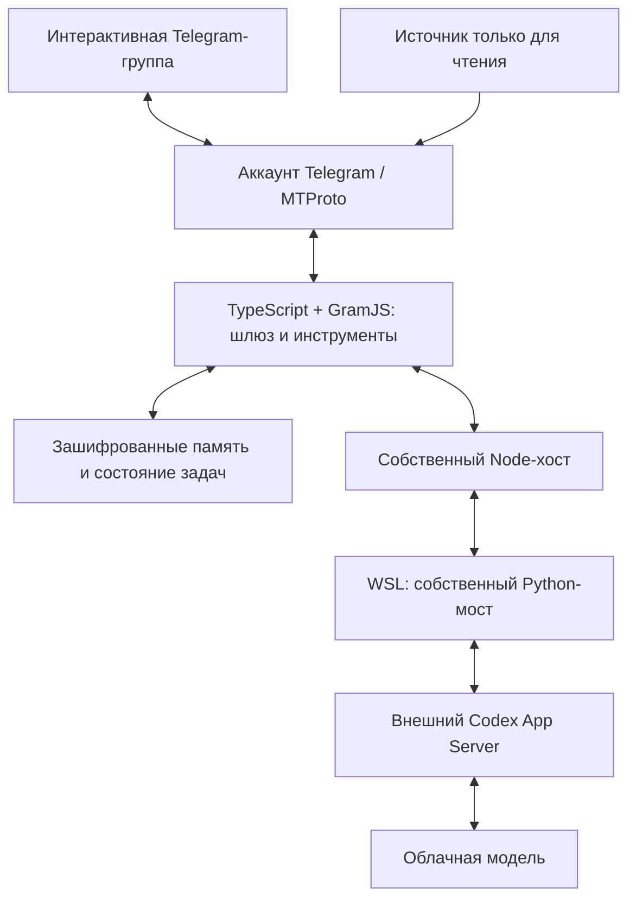

# Neurobro — AI-ассистент в Telegram

**Ассистент с памятью, инструментами и длительными задачами, который участвует в беседах через обычный Telegram-аккаунт.**

[Исходный код](https://github.com/SlopSurfer4444/Neurobro) · [Русское описание](https://github.com/SlopSurfer4444/Neurobro/blob/6f2bed54ad05f444bee16d81b0f60cc7ef7e7f83/README.ru.md) · [Архитектура](https://github.com/SlopSurfer4444/Neurobro/blob/6f2bed54ad05f444bee16d81b0f60cc7ef7e7f83/docs/architecture.md) · [Проверки](https://github.com/SlopSurfer4444/Neurobro/blob/6f2bed54ad05f444bee16d81b0f60cc7ef7e7f83/docs/testing.md)

## Задача

Сделать ассистента участником продолжающегося разговора: учитывать реплаи и прошлые действия, находить нужное в истории, работать с медиа и возвращаться с результатом длительной задачи. При этом разделить доступ к чатам, ограничить инструменты и сохранять прогресс при сбоях.

Подключение реализовано через **GramJS / MTProto и пользовательский аккаунт Telegram**. Для этого шлюза не нужны создание бота в BotFather и токен Bot API. Используется отдельный аккаунт ассистента с явно заданными чатами и правами.

## Мой вклад и роль AI-агентов

- Определял концепцию, пользовательские сценарии и правила участия в разговоре.
- Выбирал и пересматривал архитектурные решения: контекст, хранение состояния, инструменты и выполнение длительных задач.
- Координировал AI coding agents, которые реализовывали код, тесты и ревью.
- Разбирал поведение системы при интеграции и принимал результат по проверкам и использованию в Telegram-группах.

AI-агенты реализовывали код и помогали с проверками; я отвечал за направление разработки, согласование компонентов и окончательную приёмку.

## Что реализовано

| Сценарий | Решение |
|---|---|
| Участие в разговоре | Прямые обращения, реплаи, оценка продолжения беседы, настраиваемая инициатива и явное решение промолчать |
| Контекст и память | Недавние сообщения, реплаи, собственные действия, заметки и предпочтения; сборка контекста в пределах бюджета |
| Поиск по истории | Запросы и даты, чтение соседних сообщений, анализ периодов с сохранением промежуточных результатов и учётом покрытия |
| Инструменты и медиа | Изображения, интеграция генерации, файлы, опросы, реакции и другие действия в пределах прав аккаунта и разрешённых инструментов |
| Длительные задачи | Сохраняемый прогресс, отдельное составление и проверка итогового отчёта, доставка результата частями |
| Разные роли чатов | Интерактивная группа и отдельный источник только для чтения; ограничения проверяются инструментами |
| Восстановление | Зашифрованное состояние, журнал действий, проверка завершения процессов и сверка неопределённых результатов |

Доступность конкретного инструмента зависит от настроенного окружения, провайдера модели и прав Telegram-аккаунта.

## Как устроен

### Среда выполнения и ограничения доступа

WSL содержит среду исполнения и Python-мост; Node-хост связывает её с Telegram-шлюзом и управляет жизненным циклом процессов. Веса модели работают у провайдера.

Модель обращается к разрешённым инструментам через мост с проверкой запросов. Профиль среды задаёт доступ к файлам и сети; хост ограничивает действия разрешёнными чатами и управляет завершением процессов.

[Устройство и границы изоляции](https://github.com/SlopSurfer4444/Neurobro/blob/6f2bed54ad05f444bee16d81b0f60cc7ef7e7f83/docs/isolation.md) описаны по слоям и со ссылками на исходники.

Мост, управление процессами и ограничения инструментов — части проекта. **Codex App Server — внешняя зависимость, написанная на Rust, а не наш собственный Rust-код.**

Три собственных Windows-native Rust-прототипа исследуют запуск, наблюдение и ограничение процессов. Это отдельное направление; действующий мост использует Node/Python и WSL.

## Три инженерных решения

### Контекст ограничен, прогресс сохраняется

История и память не дописываются целиком в каждый запрос. Контекст собирается под бюджет, а длительный анализ сохраняет обработанные фрагменты, промежуточные результаты и покрытие. Это позволяет продолжить работу с уже собранными материалами.

### Анализ, итоговый отчёт и доставка разделены

Промежуточный анализ ещё не является ответом пользователю. Отдельный этап составляет и проверяет отчёт; доставка разбивает его на части и учитывает результат отправки. Сбой доставки не требует автоматически повторять весь анализ.

### Неопределённый результат не превращается в повторную команду

Система различает отказ до выполнения и потерянный ответ после возможного действия. Перед продолжением сверяет сохранённое состояние и завершение предыдущего исполнителя. Это снижает риск повторных действий.

## Опыт эксплуатации

Neurobro эксплуатировался в режиме **24/7 на Windows/WSL**: фоновый запуск без открытого терминала, сохранение состояния и механизмы восстановления.

## Как проверяется результат

Автономные тесты используют синтетические сообщения, имитации транспорта и временные хранилища. Они проверяют программные сценарии без входа в Telegram и обращения к живой модели. Отдельно проводилось использование в реальных Telegram-группах.

[Документация проверок](https://github.com/SlopSurfer4444/Neurobro/blob/6f2bed54ad05f444bee16d81b0f60cc7ef7e7f83/docs/testing.md) содержит результаты для публичной версии и границы проверенных сценариев.

## Технологии

TypeScript, Node.js, GramJS / MTProto, Python, WSL, Rust и Windows API. Внешнее модельное окружение — Codex App Server и облачная модель.

---

Опубликованы исходники и синтетические примеры. Переписки, данные участников, ключи, Telegram-сессии и внутренние журналы эксплуатации в публичный кейс не включены.
