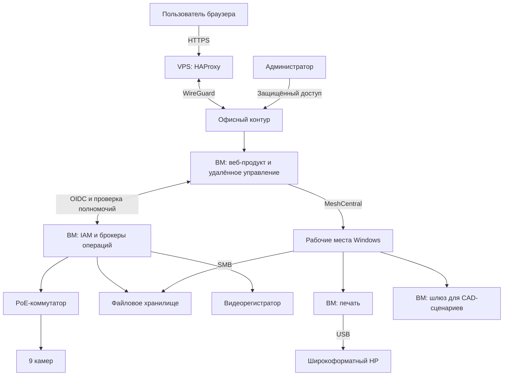

# Архитектура

## Общая схема

Схема логическая: стрелки показывают основные связи сервисов, а не разрешение произвольного сетевого доступа. Названия виртуальных машин заменены обозначениями их функций.

## Виртуализация

На физическом сервере Proxmox размещены пять ВМ. Разделение позволяет отдельно обслуживать веб-продукт, управление оборудованием, печать и прикладной сетевой шлюз.

| Условная ВМ | Назначение |
|---|---|
| Operations | MeshCentral и собственный веб-продукт |
| Management | IAM, шлюз авторизации и сервисы выполнения операций |
| Print | Сетевой приём заданий и работа с USB-плоттером |
| CAD gateway | DNS/proxy allowlist и маршруты для отдельных CAD-сценариев |
| Windows server | Отдельная среда Windows Server Evaluation в рабочей группе |

Разделение по ВМ позволяет обновлять и обслуживать каждый сервис отдельно.

## DNS, внешний доступ и VPN

Публичное имя веб-продукта связано с внешним VPS. На нём работает HAProxy, а путь к офисному сервису проходит через WireGuard. Пользователь открывает постоянный HTTPS-адрес приложения и проходит OIDC-вход. Временные callback-ссылки не используются как пользовательские закладки.

Внутренние имена и адреса нужны для обслуживания узлов. Отдельный прикладной шлюз использует DNS/proxy allowlist для своих сценариев. Правила применяются к выделенным прикладным сценариям.

VPS размещён у REG.RU. Учёт ресурсов, доменов и продления относится к эксплуатационной документации; личный кабинет, номера услуг, суммы счетов и реквизиты не входят в публичный кейс.

## Разделение интерфейса и полномочий

Браузер не получает административные пароли устройств. Вход обрабатывается IAM, а серверные компоненты проверяют роль и конкретную операцию. Управление камерой проходит через брокер, который сохраняет ход операции и проверяет результат.

Для чувствительных операций с хранилищем добавлено свежее подтверждение паролем и OTP. Короткое подписанное разрешение связано с пользователем, сессией, целью и подготовленной операцией. Возврат из входа открывает финальное подтверждение, а не запускает действие автоматически.

Административные интерфейсы сервера, NAS и аппаратного управления ограничены по источникам. Разрешённые и запрещённые источники проверялись отдельными подключениями.
