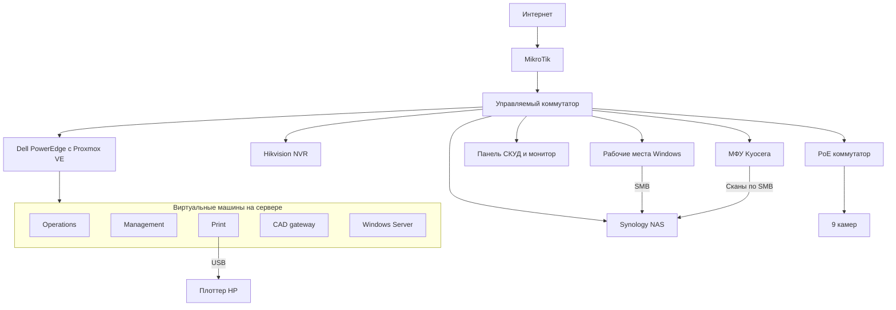
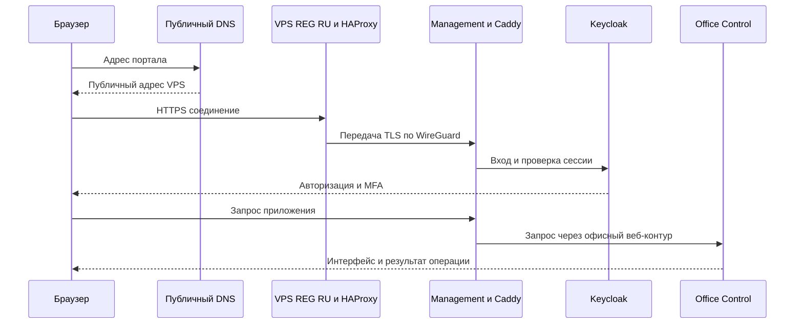

# Архитектура офисной инфраструктуры

Система состоит из физического офисного оборудования, пяти виртуальных машин на Proxmox и внешнего VPS у REG.RU. Пользовательские файлы хранятся на NAS, видео — на NVR. Виртуальные машины обслуживают приложения, управление, печать и прикладную маршрутизацию.

Названия узлов ниже условные. Схемы показывают назначение и зависимости компонентов; рабочие адреса и настройки доступа остаются в закрытой документации.

## Физический и виртуальный уровни

MikroTik выполняет маршрутизацию, NAT и функции локального DNS. Управляемый коммутатор соединяет сервер, хранилище и рабочие места. Отдельный PoE-коммутатор питает камеры. Для аппаратного обслуживания сервера используется iDRAC.

Файловое хранилище и видеорегистратор — самостоятельные устройства. NAS обслуживает общие и личные каталоги и принимает сканы; NVR хранит видеозаписи. Питание IT-оборудования и видеонаблюдения организовано через два контура ИБП.

## Назначение пяти ВМ

| Условное имя | ОС и основные компоненты | Назначение |
|---|---|---|
| Operations | Debian, MeshCentral, отдельный Node.js runtime | Удалённое обслуживание рабочих мест и компоненты офисного веб-продукта |
| Management | Debian, Caddy, Keycloak, PostgreSQL, Guacamole, шлюзы и брокеры | HTTPS, идентификация пользователей, проверка полномочий и операции с устройствами |
| Print | Debian, приёмник RAW-заданий и p910nd | Приём сетевого задания, последовательная передача USB-плоттеру |
| CAD gateway | Debian, dnsmasq, Xray, policy routing | Выборочный DNS и маршруты для согласованных прикладных сценариев |
| Windows Server | Windows Server Evaluation в рабочей группе | Отдельная серверная среда Windows |

ВМ разделяют функции обслуживания: обновление компонента печати не требует переустановки IAM или файловых служб. На Management часть сервисов работает в контейнерах; MeshCentral запускается отдельной службой с собственным runtime. Proxmox управляет виртуальными дисками, консолью и резервным копированием ВМ.

## Внешний VPS REG RU

Внешняя ВМ выполняет роль точки входа в офисный веб-сервис. Публичная DNS-запись указывает на адрес VPS. HAProxy передаёт TCP-поток по WireGuard в офис, где Caddy завершает TLS и направляет запрос к нужному сервису.

На VPS не требуется размещать базу пользователей портала или административные пароли оборудования. Публичный вход, офисная авторизация и действия над устройствами разделены. Для SSH используются ключи и ограничения источников.

Домен и VPS учитываются как отдельные услуги REG.RU. Регистрация домена определяет владение именем, DNS — направление запросов, VPS — внешний сетевой вход. Сертификат HTTPS обслуживает Caddy; его автоматическое обновление использует тот же внешний путь до офиса.

## DNS и корпоративная почта

В системе есть три назначения DNS:

- Публичные записи направляют браузер на внешний VPS портала.
- Локальные записи на MikroTik разрешают имена офисных узлов в их внутренние адреса.
- Выделенный шлюз CAD использует собственные правила для конкретных приложений.

Корпоративная почта размещена в Яндекс 360. Её доменные записи MX, SPF и DKIM относятся к почтовому сервису и обслуживаются отдельно от записи веб-портала. Изменение адреса портала не требует менять почтовую маршрутизацию.

WireGuard между офисом и VPS обеспечивает связь компонентов системы. Административный доступ использует свои разрешённые маршруты. Прикладной прокси CAD решает отдельную задачу, поэтому его настройки не подменяют управление сетью или доступ к NAS.

## Office Control как серверное приложение

Office Control объединяет интерфейс браузера, сервер на Go, журнал состояний в SQLite и специализированные шлюзы операций. Статические ресурсы встроены в приложение. Сервис работы с хранилищем использует Python. Keycloak обеспечивает OIDC-вход, роли и TOTP.

Пользователь видит карточки камер, сведения о хранилище и журнал. Сервер определяет доступные действия по роли и проверяет разрешение на конкретную операцию. Брокер обращается к оборудованию и сверяет результат; административные пароли остаются на серверной стороне.

Для чувствительного действия требуется свежая проверка пароля и OTP. Подписанное разрешение связано с пользователем, сессией и подготовленной операцией. После входа интерфейс показывает финальное подтверждение. Отмена оставляет рабочие данные без изменений.

## Основные потоки данных

| Сценарий | Путь |
|---|---|
| Открытие рабочего файла | Windows → SMB → NAS с правами пользователя |
| Сканирование | Kyocera → служебная SMB-учётка → персональный каталог NAS |
| Печать чертежа | PDF-компоновщик Windows → RAW → Print → USB-плоттер |
| Работа с картой | Windows-приложение → API панели СКУД → контрольное чтение |
| Управление камерой | Браузер → Office Control → авторизованный брокер → PoE-коммутатор → проверка состояния |
| Видеозапись | Камеры → NVR → диск видеорегистратора |
| Резервирование ВМ | Proxmox → NFS-хранилище NAS → архив Hyper Backup на внешнем диске |

## Обслуживание и восстановление

Административные интерфейсы гипервизора, NAS и аппаратного управления ограничены по источникам. Проверка изменений включает разрешённые и запрещённые подключения. Для SSH и HTTPS сохраняется проверка подлинности узла.

Четыре папки NAS зашифрованы. После перезапуска администратор разблокирует их вручную; затем восстанавливается доступ сотрудников и сканера. Ключи хранятся на двух независимых защищённых носителях. Инструкция восстановления имеет офлайн-копию.

Диагностика портала выполняется по зависимостям: DNS → внешний TCP-вход → WireGuard → Caddy → Keycloak → приложение → брокер → устройство. Такой порядок помогает найти отказавший компонент и изменить только относящиеся к нему настройки.
